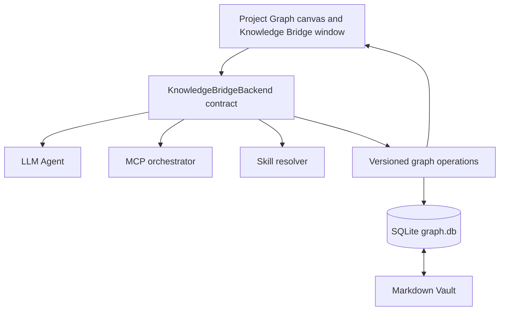

# Knowledge Bridge architecture

Knowledge Bridge keeps Project Graph as the visual, direct-manipulation entry
surface. It adds a local-first knowledge backend rather than turning the canvas
into a separate dashboard or embedding knowledge semantics in Project Graph
internals.

## 1. Entry layer: Project Graph UI

The canvas is the primary place to read and arrange knowledge. The Knowledge
Bridge window is a native Project Graph floating workspace, not a new web page.
It progressively exposes only the actions needed for the current task:

- Paste material and ask for a draft learning chain.
- Inspect why an L1 anchor and L2 mechanism were suggested, including
  confidence and alternatives.
- Explicitly approve MCP requests before they execute.
- Save a draft, apply it to the canvas, review pending mentions, or inspect
  evidence and bridge migration when needed.
- Click a managed canvas node to reuse Project Graph's single node-detail view.

The UI never calls an LLM, MCP tool runtime, or SQLite implementation directly.
It depends on the `KnowledgeBridgeBackend` contract. This is the boundary that
allows the present in-WebView implementation to become a Tauri command, Rust
sidecar, or local service without redesigning the canvas UI.

## 2. Backend layer: Agent, MCP, Skills, and operations

`LocalKnowledgeBridgeBackend` is the current local adapter. It presents four
frontend-facing capabilities:

- `draft`: ask the LLM Agent for an explainable learning-chain draft.
- `runApprovedTools`: execute only MCP requests selected by the user, validate
  them against the enabled tool schema, and return their untrusted results to
  the agent as grounding material.
- `commit`: persist a normal user-visible change as an undoable version.
- `applyOperation`: apply a typed Agent/MCP/Skill/canvas operation and persist
  it exactly once when it changes the graph.

The Agent records its selected skills, MCP catalog, proposed tool calls, invoked
tools, warnings, anchor rationale, confidence, and alternatives in the draft
trace. MCP calls are never automatic. A model result is always a draft until the
user adopts it.

## 3. Durable knowledge layer

Markdown retains prose, tags, and ordinary wikilinks. The Vault-local
`.knowledge-bridge/graph.db` is the formal relationship ledger. It holds L1--L4
nodes, logical and cognitive relationships, evidence readings, knowledge lenses,
scale protocols, AI drafts, graph proposals, migration records, and transaction
history.

Every mutation has an operation record with an ID, origin, type, and timestamp.
The origins are `user`, `canvas`, `agent`, `mcp`, and `skill`. The transaction
stores the graph before and after the mutation, so undo restores the exact prior
snapshot rather than attempting a heuristic reversal.

### Canvas mapping rules

- A confirmed draft becomes one `agent-proposal-apply` operation, then appears
  as pending managed nodes and cognitive relations on the Project Graph canvas.
- The same adopted draft is idempotent: pressing apply again cannot duplicate its
  nodes, edges, or ledger transaction.
- Managed nodes are retained across synchronization; hand-authored Project
  Graph objects are never removed.
- A canvas drag becomes a `set-canvas-positions` operation. Until that operation
  is saved, an unrelated ledger refresh cannot overwrite the on-canvas position.
- Semantic zoom only controls render visibility. It must not write coordinates
  or run a force simulation.

## Knowledge-model guards

The operation boundary preserves the product rules rather than treating every
edge as equally authoritative:

- AI-inferred anchors and bridge paths remain drafts until the user adopts them.
- Batch adoption records use of a path, not the factual truth of an L2 or its
  reuse score.
- L2 admission, freezing, and replacement migration remain ledger operations
  with full history.
- Logical relations are available to machine reasoning; cognitive relations are
  personal scaffolding. When both exist for a node pair, the logical line is the
  default canvas representation.
- Cross-scale strong claims require a confirmed conversion protocol; otherwise
  they remain an observed correlation and create a scale-gap task.
- Evidence readings retain perspective, knowledge lens, time, direction, and
  E1--E4/undetermined evaluation rather than being collapsed to one score.

## Future Project Graph updates

Keep upstream changes at the boundary described in [UPSTREAM.md](UPSTREAM.md).
When Project Graph adds a more precise node-drag completion event, replace the
current low-frequency managed-position polling in the UI adapter; the operation
contract and ledger schema do not need to change.
